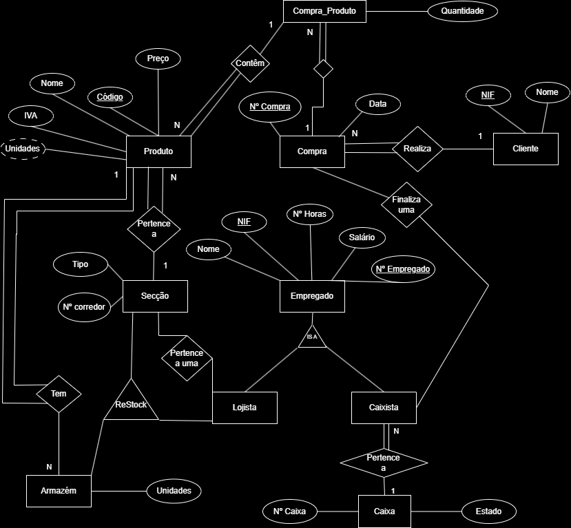

# BD: Trabalho Prático APF-T

**Grupo**: PXGY
- António Fictício, MEC: 1000
- João Inventado, MEC: 2000

# Instructions - TO REMOVE

Este template é flexível.
É sugerido seguir a estrutura, links de ficheiros e imagens, mas adicione ou remova conteúdo sempre que achar necessário.

---

This template is flexible.
It is suggested to follow the structure, file links and images but add more content where necessary.

The files should be organized with the following nomenclature:

- sql\01_ddl.sql: mandatory for DDL
- sql\02_sp_functions.sql: mandatory for Store Procedure, Functions,... 
- sql\03_triggers.sql: mandatory for triggers
- sql\04_db_init.sql: scripts to init the database (i.e. inserts etc.)
- sql\05_any_other_matter.sql: any other scripts.

Por favor remova esta secção antes de submeter.

Please remove this section before submitting.

## Introdução / Introduction
 
No contexto da unidade curricular de Base de Dados, do curso de Licenciatura em Engenharia de Computadores e Informática, foi-nos proposto criar um projeto para gerir um sistema funcional com uma complexidade razoável e aplicável ao mundo real. De forma a  cumprir o objetivo proposto decidimos desenvolver um sistema de gestão de mini mercados, onde este relatório descreverá de forma sucinta o nosso sistema, destacando todo o processo de desenvolvimento do mesmo e as partes fundamentais para o seu funcionamento.
No material fornecido em anexo, o diretório /sql estão contidos os ficheiros script necessários para criar corretamente a base de dados, e em /source uma interface desenvolvida em C# e o código relativo à mesma.
Para nossa aplicação interagir com uma base de dados, é necessário alterar o atributo data source pertencente à função getSGBDConnection no ficheiro Welcome.cs de acordo com o server name da base de dados desejada.
Também segue em anexo, os slides e vídeos usados na apresentação do projeto em /presentation.

## ​Análise de Requisitos / Requirements

Considerando um sistema de gestão de um mini mercado, este sistema terá de oferecer:
- Adicionar ou despedir empregados ao mini mercado, estes empregados poderão ser lojistas ou caixistas (operadores de caixa). Todos os empregados têm que ter um número de empregado, nome, nif, número de horas de trabalho, salário e, caso seja caixista, o número da caixa. 
- Registar os produtos do mini mercado, estes produtos são identificados por unidades, IVA, nome, preço, código e o tipo de secção a que pertencem na loja. 
- Registar as compras no mini mercado, estas compras são identificados por data, número, códigos dos produtos comprados, nif do cliente e número do empregado que finalizou a compra. 
- Monitorizar clientes do mini mercado, estes registados pelo nome e nif.
- A possibilidade de um empregado se despedir.
- Simular um dia de trabalho, ou seja, calcular o número de vendas, calcular o número de horas trabalhadas e fazer o inventário.

## DER - Diagrama Entidade Relacionamento/Entity Relationship Diagram

### Versão final/Final version



### APFE 

Melhoramos a compras sendo esta capaz de saber quantos produtos foram comprados em cada compra, com a criação de uma nova entidade Compra_Produto.
Criação de uma entidade separada para as caixas.

## ER - Esquema Relacional/Relational Schema

### Versão final/Final Version


### APFE

Fizemos as alterações segundo as melhorias no DER

## ​SQL DDL - Data Definition Language

[SQL DDL File](sql/01_ddl.sql "SQLFileQuestion")

## SQL DML - Data Manipulation Language

Uma secção por formulário.
A section for each form.

### Formulario exemplo/Example Form


```sql
-- Show data on the form
SELECT * FROM MY_TABLE ....;

-- Insert new element
INSERT INTO MY_TABLE ....;
```

...

## Normalização/Normalization

Descreva os passos utilizados para minimizar a duplicação de dados / redução de espaço.
Justifique as opções tomadas.
Describe the steps used to minimize data duplication / space reduction.
Justify the choices made.

## Índices/Indexes

Descreva os indices criados. Junte uma cópia do SQL de criação do indice.
Describe the indexes created. Attach a copy of the SQL to create the index.

```sql
-- Create an index to speed
CREATE INDEX index_name ON table_name (column1, column2, ...);
```

## SQL Programming: Stored Procedures, Triggers, UDF

[SQL SPs and Functions File](sql/02_sp_functions.sql "SQLFileQuestion")

[SQL Triggers File](sql/03_triggers.sql "SQLFileQuestion")

## Outras notas/Other notes

### Dados iniciais da dabase de dados/Database init data

[Indexes File](sql/01_ddl.sql "SQLFileQuestion")


 